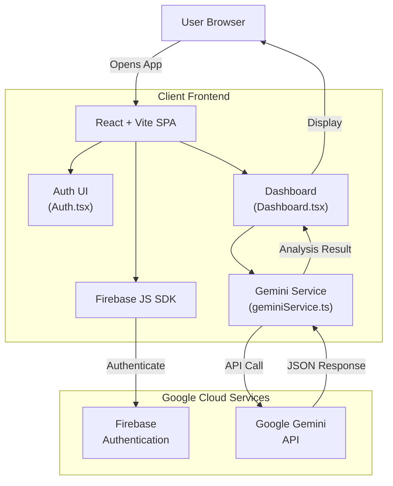
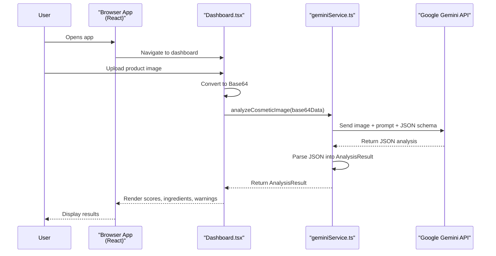

# Cosmetic Analyzer Project Documentation

## 1. High-Level Project Overview

**What is this project?**  
This is a "Cosmetic Safety Scanner" application. Think of it as a digital health assistant for your skincare and makeup products.

**User Story:**  
Imagine a user named Sarah. She is shopping for a new face cream but is worried about harmful chemicals. She opens this app in her browser, takes or uploads a picture of the ingredient label on the back of the jar, and within seconds, the app tells her:
1. **What the product is** (Name and Brand).
2. **How safe it is** (A score from 0 to 100).
3. **What's inside** (A list of ingredients).
4. **What to watch out for** (It highlights toxic or high-risk ingredients in red).
5. **A simple verdict** (e.g., "This product is generally safe, but contains fragrance which may irritate sensitive skin.").

**Core Technology:**  
Instead of looking up ingredients in a static database one by one, this app uses **Artificial Intelligence (Google Gemini)** to "read" the image like a human would, understand the text, and analyze the safety based on the rules and scoring model defined in the code.

---

## 2. System Architecture

This diagram shows how the different pieces of the application fit together, based on the current code (`App.tsx`, `components/Auth.tsx`, `components/Dashboard.tsx`, `geminiService.ts`, `firebase.ts`, and `vite.config.ts`).

### Architecture Diagram



### Explanation for Beginners:
1. **The Frontend (The Storefront):** This is what the user sees in their browser. It's built using **React** (for user interfaces) and **Vite** (to bundle and serve the app).
2. **Firebase (The Bouncer):** `firebase.ts` initializes Firebase and exposes `auth`. Components like `App.tsx` and `Auth.tsx` use this to handle login, signup, and logout.
3. **Gemini Service (The Brain):** `geminiService.ts` exposes `analyzeCosmeticImage`. It takes a Base64 image, attaches a detailed prompt (including the scoring formula), and sends it to Google Gemini using the `@google/genai` SDK.
4. **Google Gemini AI (The Expert):** This cloud service reads the image, extracts ingredients, assigns hazard levels, and (in the current implementation) calculates the safety score inside the model before returning JSON to the app.

---

## 3. Data Flow: Main Feature (Image Analysis)

This diagram explains exactly what happens to the data when a user scans a product, matching the current logic in `Dashboard.tsx` and `geminiService.ts`.

### Data Flow Diagram



---

## 4. Issues & Recommended Architectural Changes

While the current code works end-to-end, the repository shows several risks and improvement opportunities, especially around security and reliability.

### 🔴 Critical Security Issue: API Key Exposure

**What the code does today:**  
In `vite.config.ts`, the app defines:

```ts
'process.env.API_KEY': JSON.stringify(env.GEMINI_API_KEY),
'process.env.GEMINI_API_KEY': JSON.stringify(env.GEMINI_API_KEY)
```

`geminiService.ts` then reads `process.env.API_KEY` to construct the `GoogleGenAI` client **directly in the browser**.

**Why this is dangerous (beginner version):**  
This is like taping your house key to the front door. When Vite builds your site, it **embeds** the Gemini API key into the JavaScript bundle that runs in every user's browser. Anyone can open DevTools, inspect the code, and steal your key, then use your Google account to run their own AI jobs.

**Recommended fix (future architecture):**
- Move the Gemini call to a **backend** (e.g., Firebase Cloud Functions or another server).
- The frontend should send the image (or a reference) to your backend.
- The backend should call Gemini using the secret API key **stored server-side only**.
- The backend returns only the safe analysis JSON to the browser.

### ✅ Reliability Issue: AI Doing Math (Resolved)

**What the code does today:**  
The prompt in `geminiService.ts` asks Gemini to calculate the safety score:

```text
Total Risk = (1 × L) + (3 × M) + (5 × H)
Maximum Possible Risk = 5 × (L + M + H)
Safety Score = (1 - (Total Risk / Maximum Possible Risk)) × 100
```

and then return `overallSafetyScore` as part of the JSON response.

**Why this is risky:**  
Large Language Models (like Gemini/ChatGPT) are great at language but not perfect calculators. Even with a clear formula, they can sometimes:
- Mis-count ingredients in each hazard bucket.
- Make arithmetic mistakes.
- Return inconsistent scores for the same ingredients.

**Resolution (Implemented):**
We have moved the scoring logic to **TypeScript** in `geminiService.ts`.

1. Gemini identifies ingredients and assigns hazard levels (Low, Medium, High).
2. The app calculates the score deterministically:
   ```ts
   Safety Score = (1 - (Total Risk / Max Risk)) * 100
   ```

This ensures that if the ingredients are identified correctly, the score is always mathematically correct.

### 🟡 Code Quality & Error Handling

**What the code does today:**
- `geminiService.ts`:
  - Calls Gemini and then does `JSON.parse(response.text.trim())`.
  - If `response.text` is missing or not valid JSON, it throws an `Error`.
- `Dashboard.tsx`:
  - Wraps the call to `analyzeCosmeticImage` in a `try/catch`.
  - On any error, logs `"Analysis failed"` and shows a generic alert:  
    `"Something went wrong during analysis. Please try a clearer image."`

This means:
- The UI does not distinguish between:
  - Bad network connections.
  - Malformed AI responses.
  - Non-cosmetic images.
- The only feedback is a generic browser alert, not a friendly in-UI message.

**Recommended improvements:**
- Define a typed error shape (e.g., `AnalysisError`) and have `geminiService.ts` normalize different failure modes:
  - Network/timeout.
  - Invalid/missing JSON.
  - AI refusal or low-confidence responses.
- Return structured errors to `Dashboard.tsx` and display them inline:
  - e.g., a card that says:  
    "We couldn’t read this label. Please upload a clearer, close-up photo of the ingredients."
- Optionally log technical details (stack traces, raw responses) only in the console or to a monitoring service, not in the user-facing UI.
