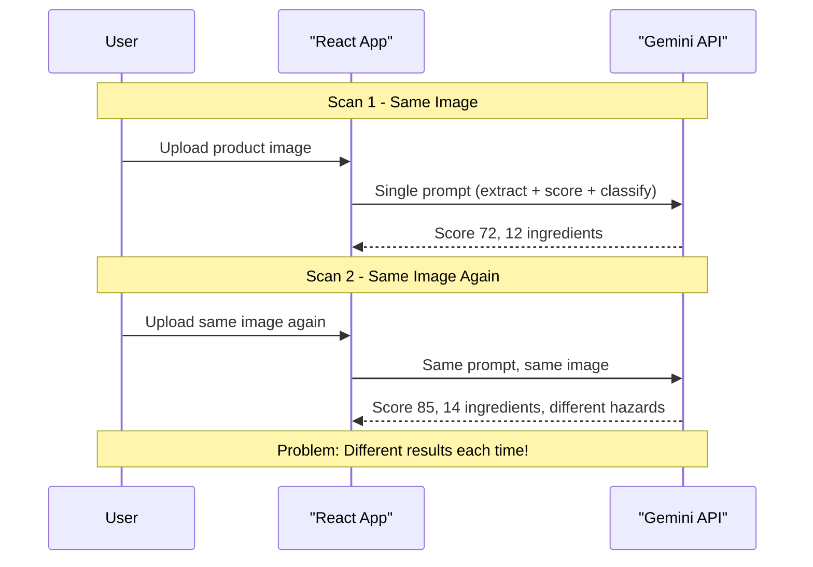
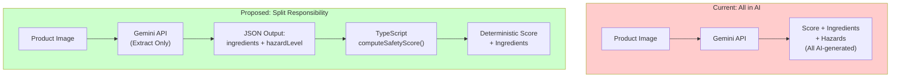
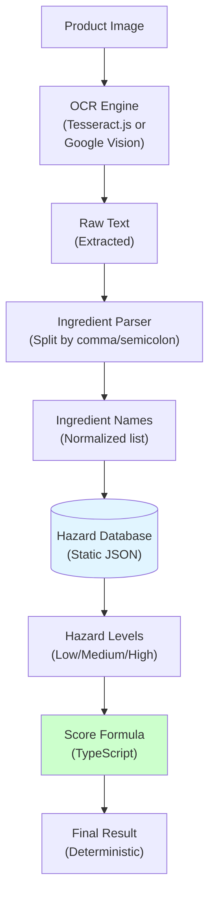
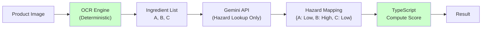
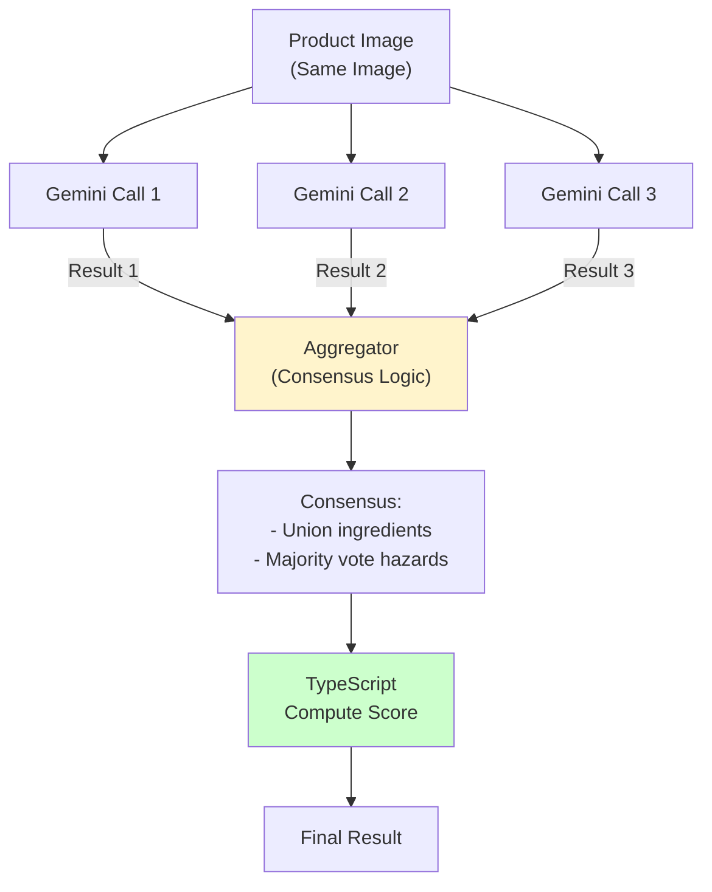
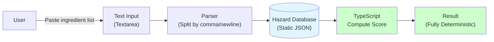

# Cosmetic Analyzer: Main Feature Upgrade Proposal

> **Context:** The current image-to-analysis flow relies on a single AI call to both extract ingredients and compute a safety score. Because the model is stochastic, scanning the *same* product image multiple times yields different scores, ingredient lists, and hazard classifications—undermining user trust.
> **Update:** We have implemented **Option A** (AI Extraction + Deterministic Scoring) as of the latest refactor.

---

## 1. Target User Story (Ideal Scenario)

**As a** health-conscious shopper at a store,  
**I want** to photograph a cosmetic’s ingredient label and see a stable, trustworthy safety score,  
**So that** I can reliably decide whether to buy the product.

**Acceptance criteria:**
1. **Deterministic score:** Scanning the same product twice produces the *same* safety score.
2. **Reproducible ingredients:** The extracted ingredient list is identical across scans of the same image.
3. **Transparent logic:** Hazard levels are derived from a verifiable source (e.g., a database or a fixed formula), not arbitrary AI output.
4. **Good UX:** The flow remains image-driven with minimal extra steps.

---

## 2. Current Limitations (Failed Scenario)

**As a** user who scanned a moisturizer three times to verify results,  
**I experience** different scores (72, 85, 68) and different ingredient counts each time,  
**So that** I lose confidence in the app and wonder whether it’s trustworthy.

**What actually happens today:**



| Scan | Safety Score | Ingredient Count | Notes |
|------|--------------|------------------|-------|
| 1    | 72           | 12               | Paraben marked High |
| 2    | 85           | 14               | Paraben marked Medium; extra ingredient |
| 3    | 68           | 11               | Different toxic compounds list |

**Root cause:** One AI call handles OCR, hazard classification, and score calculation. The model has no memory between calls and produces non-deterministic output.

---

## 3. Proposed Solutions

Below are five approaches to improve consistency. Each is scored on:
- **Ease of implementation** (1–5, 5 = easiest)
- **Probability of success** (1–5, 5 = most likely to achieve target)
- **Overall score** (1–5, 5 = best tradeoff)

---

### Option A: AI Extraction + Deterministic Scoring (Split Responsibility)

**Idea:** Use AI only for extraction (ingredient list + hazard level per ingredient). Compute the safety score in TypeScript using the existing formula.



| Metric | Score | Notes |
|--------|-------|------|
| Ease of implementation | 4/5 | Prompt + schema change; add `computeSafetyScore()` in app |
| Probability of success | 4/5 | Score becomes deterministic; ingredients may still vary slightly |
| **Overall** | **4/5** | Low effort, clear gain; best first step |

**Implementation plan:**

1. **Refactor prompt** (`geminiService.ts`):
   - Remove any instruction to compute the score.
   - Output: `{ productName, brand, ingredients: [{ name, purpose, hazardLevel, description }], toxicCompounds }`.
   - Do not include `overallSafetyScore` in the schema.

2. **Add scoring module** (`scoreUtils.ts`):

```ts
// scoreUtils.ts
export function computeSafetyScore(ingredients: { hazardLevel: string }[]): number {
  const L = ingredients.filter(i => i.hazardLevel === 'Low').length;
  const M = ingredients.filter(i => i.hazardLevel === 'Medium').length;
  const H = ingredients.filter(i => i.hazardLevel === 'High').length;
  const total = L + M + H;
  if (total === 0) return 0;
  const totalRisk = L * 1 + M * 3 + H * 5;
  const maxRisk = 5 * total;
  return Math.round((1 - totalRisk / maxRisk) * 10000) / 100;
}
```

3. **Wire up in `geminiService.ts`:** After parsing AI response, call `computeSafetyScore(result.ingredients)` and attach to the returned object.

4. **Update types:** `overallSafetyScore` remains in `AnalysisResult`; it is now computed, not AI-generated.

---

### Option B: Pure OCR + Static Hazard Database

**Idea:** Replace AI extraction with deterministic OCR (e.g., Tesseract.js or Google Vision). Match extracted strings against a curated hazard database. Compute score entirely in code.



| Metric | Score | Notes |
|--------|-------|------|
| Ease of implementation | 3/5 | New deps (Tesseract/Cloud Vision); build/maintain hazard DB |
| Probability of success | 5/5 | Fully deterministic if OCR and DB are stable |
| **Overall** | **4/5** | Best consistency; more upfront work |

**Implementation plan:**

1. **Add OCR dependency:**
   - Client: `tesseract.js` (runs in browser).
   - Or server: Google Cloud Vision API.

2. **Build hazard database:**
   - Use a public source (e.g., EWG, CosIng, PubMed) or a curated JSON file.
   - Schema: `{ "sodium lauryl sulfate": "High", "glycerin": "Low", ... }`.

3. **Ingredient parsing:**
   - Split OCR text by commas/semicolons; normalize (lowercase, trim).
   - Fuzzy match against DB keys for common typos.

4. **Scoring:** Same `computeSafetyScore()` as Option A, using DB-derived hazard levels.

5. **Fallback:** For ingredients not in DB, default to "Medium" or "Unknown" and surface in UI.

---

### Option C: OCR for Extraction + AI for Hazard Lookup Only

**Idea:** OCR gives a deterministic ingredient list. A separate AI call (or batch) only assigns hazard levels per ingredient. Score is computed in code.



| Metric | Score | Notes |
|--------|-------|------|
| Ease of implementation | 3/5 | Two pipelines; need robust OCR + structured AI call |
| Probability of success | 4/5 | Extraction stable; hazard assignment still AI-dependent |
| **Overall** | **3.5/5** | Good middle ground; moderate complexity |

**Implementation plan:**

1. **OCR step:** Use Tesseract.js (or Vision API) to get raw text; parse into an array of ingredient names.

2. **AI hazard prompt:** Send only the list of ingredient names (no image), e.g.:
   ```
   For each ingredient below, return its hazard level (Low, Medium, High) based on cosmetic safety data.
   Ingredients: Sodium Hyaluronate, Parabens, Glycerin, ...
   Respond with JSON: { "Sodium Hyaluronate": "Low", ... }
   ```

3. **Merge and score:** Map AI output to ingredients; run `computeSafetyScore()`.

4. **Caching (optional):** Cache hazard results per ingredient to reduce API calls on repeat scans.

---

### Option D: Multi-AI Consensus

**Idea:** Run 2–3 AI calls with the same image; aggregate ingredients and hazard levels (e.g., majority vote); compute score from the consensus.



| Metric | Score | Notes |
|--------|-------|------|
| Ease of implementation | 3/5 | Parallel calls + aggregation logic |
| Probability of success | 3/5 | Reduces variance but does not eliminate it; 3× cost |
| **Overall** | **3/5** | Expensive; limited consistency gain |

**Implementation plan:**

1. **Parallel calls:** `Promise.all([analyze(...), analyze(...), analyze(...)])`.

2. **Aggregation rules:**
   - Ingredients: union of all lists; deduplicate by normalized name.
   - Hazard level: majority vote per ingredient; on tie, use "Medium".
   - Product name/brand: majority or first non-empty.

3. **Score:** `computeSafetyScore()` on the aggregated list.

4. **Cost control:** Optional—run extra calls only when trust is low or user requests "double-check."

---

### Option E: Manual Ingredient Entry + Database Lookup

**Idea:** Remove image analysis entirely. User types or pastes the ingredient list. App matches against a hazard database and computes the score.



| Metric | Score | Notes |
|--------|-------|------|
| Ease of implementation | 5/5 | Simplest—no image, no OCR, no AI for extraction |
| Probability of success | 5/5 | Fully deterministic |
| **Overall** | **4/5** | Best reliability; worse UX (manual entry) |

**Implementation plan:**

1. **Add input mode:** Toggle or second tab: "Enter ingredients manually."

2. **Text input:** Textarea; parse on submit (split by comma, semicolon, newline).

3. **Database lookup:** Same hazard DB as Option B; fuzzy match for typos.

4. **Scoring:** `computeSafetyScore()`.

5. **Optional:** Keep image flow as "quick scan," manual as "precise mode."

---

## 4. Summary Matrix

| Option | Ease (1–5) | Success (1–5) | Overall (1–5) | Main tradeoff |
|--------|------------|---------------|---------------|----------------|
| A: AI Extract + Code Score | 4 | 4 | **4** | Fast to implement; score fixed, extraction still variable |
| B: OCR + Static DB | 3 | 5 | **4** | Best consistency; more work on DB + OCR |
| C: OCR + AI Hazard Only | 3 | 4 | **3.5** | Balanced; two systems to maintain |
| D: Multi-AI Consensus | 3 | 3 | **3** | Reduces variance; high cost, not fully deterministic |
| E: Manual Entry + DB | 5 | 5 | **4** | Easiest, fully deterministic; higher user friction |

---

## 5. Recommended Path

1. **Short term:** Implement **Option A** (AI extraction + deterministic scoring). Small change, immediate improvement to score consistency.

2. **Medium term:** Add **Option E** as a "precise mode" for users who want full control and reproducibility.

3. **Long term:** Consider **Option B** (OCR + hazard DB) if you need fully deterministic, image-based analysis and are ready to maintain a hazard database.
